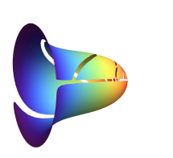

#  Voluble - let your GNOME desktop speak to you.</img>
[](https://extensions.gnome.org/extension/6849/voluble/)
Voluble is a simple GNOME shell extension that brings a natural-sounding, human-like voice to the desktop notifications used to alert the GNOME user of desktop events, appointments, e-mails, etc. Here is an example video:


https://github.com/QuantiusBenignus/voluble/assets/120202899/2e0d9d5e-0c18-4f8c-9219-11b3bc0e5a2d


Voluble is not an accessibility tool, it does not aim to replace tools like Orca which expose functionality needed by users with disabilities. It simply enhances the desktop notifications by reading them outloud, in the absence of (or in addition to) any sound that might accompany the notification. This way, the user will be properly alerted and will not risk missing even the most transient of notifications, clearly hearing what the computer has to say, even when not looking. A reason for creating this extension has been the desire to hear the contents of notifications for appointments and to-do's from the [Joplin note-taking app](https://joplinapp.org).


### Piper
Unlike the default installation of the afforementioned Orca (and speech-dispatcher in the background), Voluble uses a modern neural text-to-speech (TTS) engine called [Piper](https://github.com/rhasspy/piper). Among the multiple (and growing) choices of human-sounding neural TTS options, Piper is fast and lightweight for its decent quality (a quantum leap from the default espeak-ng in speech dispatcher). 
For a [quick start](#quick-start), we can set up Voluble to use Piper directly, completely ignoring the infrastructure provided by speech dispatcher. 
If instead, we do not want to go rogue and prefer to play nice with the system logic, it is actually possible to use [speech dispatcher](#speech-dispatcher-integration) to call Piper as a backend synthesizer to speak out-loud the notifications but we need to register Piper as a valid backend module first. The advantage with Piper set as the default speech synthesizer in speech dispatcher is that accessibility tools like Orca will then also sound nice. Just pressing `Super + Alt +S` will start Orca with Piper and we will hear clear human-like voice as we navigate the GNOME GUI. 

### Quick Start

- Download Piper from the [GitHub releases page](https://github.com/rhasspy/piper/releases). It can be run with Python, but the binary releases are suggested here as they can give an edge of performance in this scenario.
- Download the desired voice files (a .onnx and a json file per each voice) for the language(s) of choice. As of this writing, [30 languages](https://github.com/rhasspy/piper?tab=readme-ov-file#voices) are supported. You can listen to samples and download files [here](https://rhasspy.github.io/piper-samples/). Once downloaded, make sure that each .json file is named exactly like its corresponding  .onnx voice file.
- Make a symbolic link in your $PATH (say, in `~/.local/bin`) to the `piper` executable:
```
 ln -s ~/FOLDER_WITH_EXTRACTED_PIPER/piper ~/.local/bin/piper
```
- Install the Voluble GNOME shell extension 
	-- either with one click install from the [GNOME extension website](https://extensions.gnome.org/extension/6849/voluble/).
	
	-- or manually, by clonning the code from github:
```
git clone https://github.com/QuantiusBenignus/voluble && cd voluble && \
unzip voluble@quantiusbenignus.local.zip -d $HOME/.local/share/gnome-shell/extensions/ && \
gnome-extensions enable voluble@quantiusbenignus.local

```

- Download the helper script `voluble` for this extension (if not cloned already), place it in your $PATH and make it executable, for example:
```
cd ~/.local/bin && wget https://github.com/QuantiusBenignus/voluble/blob/main/voluble  && chmod +x voluble
```
That is it, now the extension should work by speaking out-loud in human-like voice all that the computer has to say via notifications.

### Speech Dispatcher Integration
Speech Dispatcher is a core accessibility tool designed to facilitate speech synthesis for people with visual impairments. It acts as a bridge between client applications (programs that produce spoken text) and software speech synthesizers (programs that convert text into speech).
Speech Dispatcher would typically come preinstalled in many Linux distributions with the espeak-ng TTS engine as the default. The result does not sound good at all when compared with the quality of the new neural TTS engines. Here is a comparison, justifying the integration of Piper with speech dispatcher:

With espeak-ng | With Piper 
:-: | :-:
<video src="https://github.com/QuantiusBenignus/voluble/assets/120202899/3a84d722-e9ef-4120-afff-0b9224e188a3" width=160/> | <video src="https://github.com/QuantiusBenignus/voluble/assets/120202899/fea8bce4-9fcc-430d-a4d9-d1a75add8b9f" width=160/>

- Configuration files (speechd.conf) are located in /etc/speech-dispatcher/ for system-wide settings and ~/.config/speech-dispatcher/ for per-user preferences.
-  The `spd-conf` tool allows one to modify configuration options interactively or create per-user speech dispatcher configuration.
- Integration with synthesizers (TTS engines)  is done via module configuration, but unfortunatelly, the supplied preconfigured modules sound unnatural, robotic and not quite intelligible.
- It is possible, with some work, to configure Piper as a TTS module for Speech Dispatcher.
	1. First create a generic local (per user) speech-dispatcher setup with the `spd-conf` tool, using `sd_generic` as the default module.
 	2. Then register Piper as a valid TTS module by editing `~/.config/speech-dispatcher/speechd.conf`. Most stuff can be left as is (all is well commented). An excerpt of the relevant parameters in my case shown here:
     
	```
 		# The Default language with which to speak
 		# Note that the spd-say client in particular always sets the language to its
 		# current locale language, so this particular client will never pick this configuration.
 		
 		DefaultLanguage   en-US
		 
 		# Pulse audio is the default and recommended sound server. OSS and ALSA
 		# are only provided for compatibility with architectures that do not
 		# include Pulse Audio. 
 
 		AudioOutputMethod   alsa
 
 		# The next ones are instrumental, find them in their respective sections
 		
 		AddModule "piper"              "sd_generic"   "piper.conf"
 		DefaultModule piper
 		LanguageDefaultModule "en"  "piper"
 		LanguageDefaultModule "fr"  "piper"
	```

	3. Then create a suitable `piper.conf` file in `~/.config/speech-dispatcher/modules/`. Here is an example `piper.conf` [adapted for my case from here](https://github.com/brailcom/speechd/issues/866#issuecomment-1869106771):
 
	```
		Debug 0
		GenericExecuteSynth "printf %s \'$DATA\' | piper --length_scale 1 --sentence_silence 0 --model ~/Store/Models/piper/$VOICE --output-raw | aplay -r 16000 -f S16_LE -t raw -"
		# Using low quality voices to respect the 16000 rate for aplay in the command above is perfectly fine.
		
		GenericCmdDependency "piper"
		GenericCmdDependency "aplay"
		GenericCmdDependency "printf"
		GenericSoundIconFolder "/usr/share/sounds/sound-icons/"
		GenericPunctNone ""
		GenericPunctSome "--punct=\"()<>[]{}\""
		GenericPunctMost "--punct=\"()[]{};:\""
		GenericPunctAll "--punct"
		
		#GenericStripPunctChars  ""

		GenericLanguage  "en" "en_US" "utf-8"
		GenericLanguage  "en" "en_GB" "utf-8"
		GenericLanguage  "fr" "fr_FR" "utf-8"
		
		AddVoice        "en"    "MALE1"         "en_US-lessac-low.onnx"
		AddVoice        "en"    "FEMALE1"       "en_US-amy-low.onnx"
		AddVoice        "fr"    "MALE1"         "fr_FR-gilles-low.onnx"
		AddVoice        "en"    "MALE2"         "en_GB-alan-low.onnx"
		
		DefaultVoice    "en_US-lessac-low.onnx"
	```

	4. The newly created setup can then be tested with `spd-say`, for example:
		`$ spd-say "Your computer can now speak to you nicely`
- Now all you have to do is set the option `use_spd=1` in the CONFIG block of the `voluble` helper  script to use speech-dispatcher instead of calling piper directly.

### To-Do

- [ ] Add automatic translation for the extension GUI
- [ ] Add extension code for ver. 45+ of the GNOME shell

### Credits

- Michael Hansen for making Piper a low-resource, good-quality speech synthesizer.
- The maintainers of the GNOME project.

